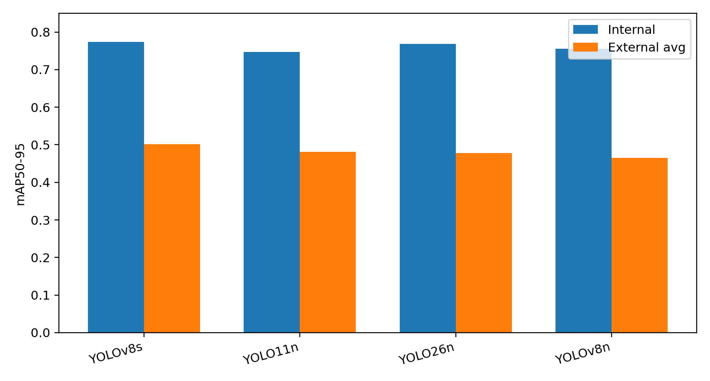
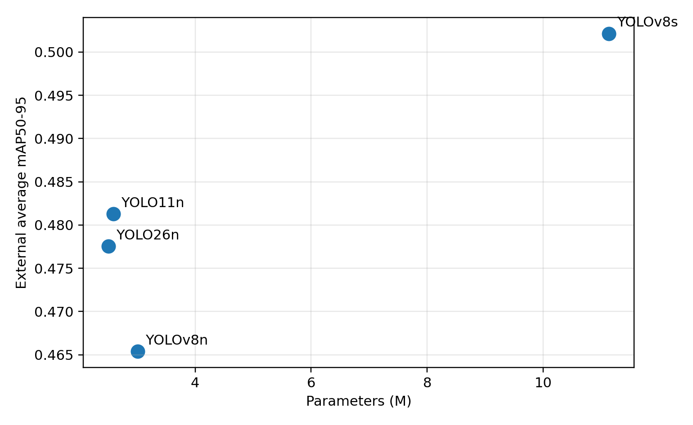
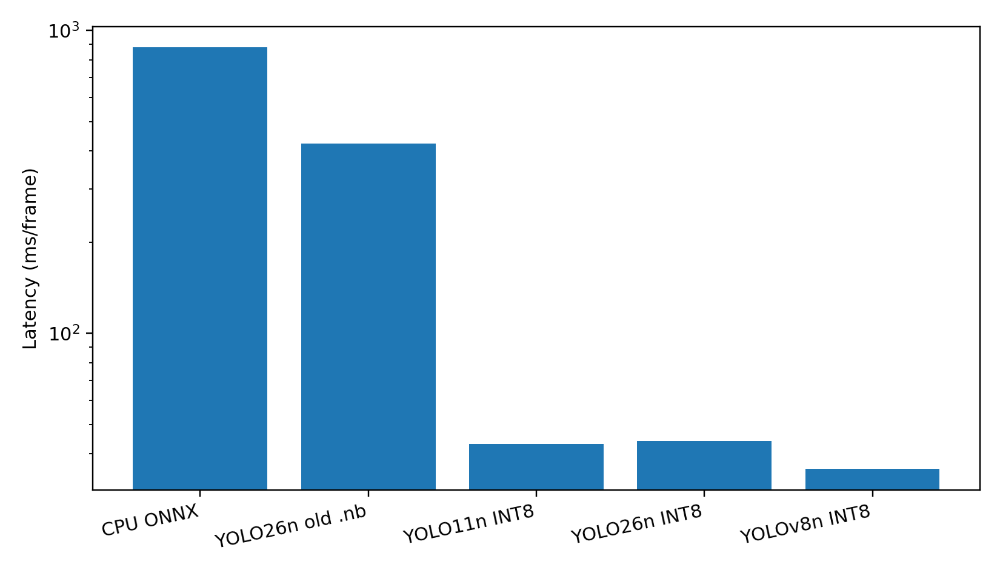
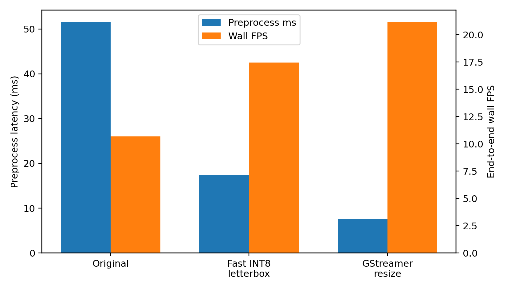

# Low-Power Real-Time Colonoscopy Polyp Detection on STM32MP257 NPU

> This is a research and education prototype. It is not a diagnostic device and
> is not intended for patient care.

## Abstract

Colonoscopy polyp detection is a clinically meaningful computer-aided detection
task because detected candidate lesions can directly guide endoscopist attention
during a procedure. This project develops a lightweight edge-AI prototype for
real-time polyp detection using public gastrointestinal datasets and
STM32MP257 NPU deployment.

Segmentation annotations from multiple public datasets were converted into YOLO
bounding boxes, and four YOLO variants were trained under the same multi-dataset
protocol: YOLOv8n, YOLO11n, YOLO26n, and YOLOv8s. Cross-dataset evaluation was
performed on an internal holdout set and three external datasets:
CVC-ClinicDB, CVC-ColonDB, and ETIS-LaribPolypDB.

YOLOv8s achieved the highest external average mAP50-95 of 0.502, while YOLO11n
was the strongest nano-scale accuracy candidate with external average mAP50-95
of 0.481. For embedded deployment, YOLOv8n was selected because its
full-integer INT8 TFLite model was successfully converted to STM32MP257 NPU
format and benchmarked at 35.70 ms per inference, corresponding to 28.01 FPS.

## 1. Introduction

Colorectal cancer is a major global health burden, and colonoscopy is clinically
important because it enables both detection and removal of premalignant lesions.
Computer-aided detection systems are already clinically relevant in endoscopy,
but most real-time solutions are high-end and closed. A course-scale biomedical
AI project can therefore be clinically persuasive if it studies the complete
workflow from public datasets to external validation and real-time edge
deployment.

The goal of this project is not to claim clinical readiness. Instead, the goal
is to build a rigorous research prototype and measure whether a lightweight YOLO
detector can preserve useful cross-dataset accuracy while running in real time
on a constrained STM32MP257 NPU after INT8 quantization.


**Figure 1. Overall system architecture.** The proposed workflow connects public
endoscopy datasets, annotation harmonization, YOLO model comparison, INT8
quantization, STM32MP257 NPU deployment, and real-time video inference.

## 2. Materials and Methods

### 2.1 Datasets

The project used multiple public gastrointestinal endoscopy datasets to reduce
dependence on a single source distribution:

| Dataset | Material | Role |
| --- | --- | --- |
| Kvasir-SEG | Polyp images with segmentation masks | Multi-dataset training and validation |
| PolypGen positive cropped | Positive polyp frames with regional annotations | Additional positive-domain training and testing |
| Hyper-Kvasir segmented positives | Lower-GI polyp images with segmentation annotations | Additional positive-domain training and testing |
| Hyper-Kvasir lower-GI negatives | Lower-GI non-polyp frames | Negative/background examples |
| CVC-ClinicDB | Colonoscopy frames with polyp masks | External validation |
| CVC-ColonDB | Colonoscopy frames with polyp masks | External validation |
| ETIS-LaribPolypDB | Colonoscopy frames with polyp masks | External validation |

The final multi-dataset split contained 6,127 training images, 775 validation
images, and 657 internal test images. CVC-ClinicDB, CVC-ColonDB, and ETIS were
kept as external test datasets to assess generalization under domain shift.


**Figure 2. Dataset composition and usage.** Training data combined multiple
positive polyp sources and negative lower-GI examples, while independent
datasets were reserved for external testing.

### 2.2 Annotation Conversion

All datasets were standardized into YOLO detection format. For segmentation
datasets, each positive mask was converted into a bounding rectangle. Negative
frames were retained as images with empty label files, allowing the detector to
learn background rejection.


**Figure 3. Data preprocessing pipeline.** Heterogeneous segmentation and
classification-style resources were converted into a unified YOLO image-label
format for single-class polyp detection.

### 2.3 Model Training

Four YOLO models were trained using the same multi-dataset protocol:

| Item | Setting |
| --- | --- |
| Input size | 416 x 416 |
| Models | YOLOv8n, YOLO11n, YOLO26n, YOLOv8s |
| Epochs | 80 |
| Batch size | 32 |
| Seed | 42 |
| Task | Single-class polyp detection |
| Augmentation | HSV jitter, translation, scale jitter, shear, perspective, flip, mosaic, mixup |

YOLOv8s was included as an accuracy upper-bound model. YOLOv8n, YOLO11n, and
YOLO26n represented compact deployment-oriented candidates.


**Figure 4. Training, quantization, and deployment workflow.** Trained YOLO
checkpoints were evaluated, exported, quantized to full-integer INT8 TFLite
where possible, and converted to STM32MP257-compatible `.nb` files.

### 2.4 Evaluation Protocol

Accuracy was measured using precision, recall, mAP50, and mAP50-95. Internal
holdout performance estimates behavior within the assembled multi-dataset
distribution. External validation on CVC-ClinicDB, CVC-ColonDB, and ETIS was
treated as the key generalization test.

## 3. Results

### 3.1 Cross-Dataset Accuracy

| Model | Params | GFLOPs | Internal mAP50-95 | External Avg mAP50-95 | External Avg Recall |
| --- | ---: | ---: | ---: | ---: | ---: |
| YOLOv8s | 11.14M | 12.10 | 0.774 | 0.502 | 0.762 |
| YOLO11n | 2.59M | 2.72 | 0.748 | 0.481 | 0.703 |
| YOLO26n | 2.50M | 2.44 | 0.768 | 0.478 | 0.690 |
| YOLOv8n | 3.01M | 3.46 | 0.756 | 0.465 | 0.720 |



**Figure 5. Internal holdout and external-average mAP50-95.** The drop from
internal to external performance shows the importance of cross-dataset testing.

### 3.2 External Dataset Performance

| Model | CVC-ClinicDB mAP50-95 | CVC-ColonDB mAP50-95 | ETIS mAP50-95 |
| --- | ---: | ---: | ---: |
| YOLOv8s | 0.559 | 0.455 | 0.493 |
| YOLO11n | 0.548 | 0.425 | 0.471 |
| YOLO26n | 0.579 | 0.426 | 0.428 |
| YOLOv8n | 0.536 | 0.408 | 0.452 |

### 3.3 Model Selection and Accuracy-Latency Trade-off

The final model was selected using both accuracy evidence and deployment
evidence. The parameter-versus-external-mAP figure explains the
accuracy-complexity relationship, while STM32MP257 NPU measurements explain the
real embedded latency.



**Figure 6. Accuracy-complexity trade-off.** YOLOv8s achieved the best accuracy
but used substantially more parameters. Compact models were therefore compared
again using measured NPU latency and video stability.

| Model | Accuracy and Size Evidence | NPU Deployment Evidence | Decision |
| --- | --- | --- | --- |
| YOLOv8s | Best accuracy: external avg mAP50-95 0.502; 11.14M parameters | Not selected for final embedded demo because of larger complexity | Accuracy upper bound |
| YOLO11n INT8 | Best nano accuracy: external avg mAP50-95 0.481; 2.59M parameters | 43.20 ms, 23.15 FPS on STM32MP257 NPU | Valid but slower than YOLOv8n |
| YOLO26n INT8 | Compact: external avg mAP50-95 0.478; 2.50M parameters | 44.08 ms, 22.69 FPS; weaker video detection stability | Not selected |
| YOLOv8n INT8 | Competitive accuracy: external avg mAP50-95 0.465; 3.01M parameters | 35.70 ms, 28.01 FPS; stable sample-video detections | Selected final model |

YOLOv8n INT8 was selected because it provided the fastest verified
STM32MP257 NPU inference while maintaining competitive cross-dataset detection
accuracy and a complete working video pipeline.

### 3.4 Embedded NPU Deployment

| Experiment | Runtime Format | Latency | FPS | Interpretation |
| --- | --- | ---: | ---: | --- |
| YOLOv8n ONNX CPU | FP32 ONNX Runtime CPU | 879.63 ms/frame | 1.14 | Baseline fallback; not real-time |
| YOLO26n previous `.nb` | NPU, float16 I/O | 422.70 ms | 2.37 | Not true INT8 behavior; rejected |
| YOLO11n full-integer `.nb` | NPU, int8 I/O | 43.20 ms | 23.15 | Valid but slower than YOLOv8n |
| YOLO26n full-integer `.nb` | NPU, int8 I/O | 44.08 ms | 22.69 | Lower video detection stability |
| YOLOv8n full-integer `.nb` | NPU, int8 I/O | 35.70 ms | 28.01 | Selected embedded demo model |



**Figure 7. STM32MP257 inference latency comparison.** Full-integer INT8 NPU
deployment reduced model inference latency by more than an order of magnitude
relative to CPU ONNX execution.

### 3.5 End-to-End Video Pipeline Optimization

NPU inference alone was not the only bottleneck. Python preprocessing initially
dominated the end-to-end video pipeline. A direct INT8 letterbox preprocessing
path reduced preprocessing cost while preserving YOLO geometry.

| Pipeline | Preprocess | NPU | Decode/NMS | Wall FPS | Detected Frames |
| --- | ---: | ---: | ---: | ---: | ---: |
| Original Python pipeline | 51.64 ms | 36.36 ms | 1.47 ms | 10.68 | 87 / 200 |
| Fast INT8 letterbox pipeline | 17.47 ms | 36.59 ms | 1.64 ms | 17.44 | 87 / 200 |
| GStreamer direct resize | 7.60 ms | 37.48 ms | 1.20 ms | 21.19 | 45 / 200 |



**Figure 8. Preprocessing optimization.** Direct INT8 letterbox preprocessing
improved end-to-end throughput while preserving detection behavior.


**Figure 9. STM32MP257 inference pipelines.** The final selected route keeps
YOLO letterbox geometry and generates the INT8 tensor directly. The faster
GStreamer direct-resize route changed image geometry and reduced detections in
the sample video.

## 4. Discussion

The results support the feasibility of a clinically motivated edge-AI prototype.
The clinical relevance comes from the direct procedural use case: a highlighted
suspected polyp can prompt closer inspection during colonoscopy. The engineering
contribution is the measured path from public datasets to NPU-executed INT8
inference on STM32MP257.

The model comparison shows a clear accuracy-deployment trade-off. YOLOv8s is
the best accuracy model, but its 11.14M parameters make it less attractive for
low-power real-time deployment. YOLO11n is the strongest nano-scale accuracy
candidate, but its measured NPU latency was slower than YOLOv8n. YOLO26n is
compact, but its INT8 deployment showed lower detection stability in the sample
video. Therefore, YOLOv8n is the most defensible final demonstration model.

The preprocessing experiments also show that real-time embedded AI is a
complete pipeline problem. Image decode, resize, channel conversion,
quantization, NMS, and overlay rendering must be measured alongside NPU model
latency.

## 5. Limitations

- This is a research prototype and not diagnostic or regulatory-grade software.
- Public research datasets do not replace prospective patient-level validation.
- The video demonstration uses dataset-derived video rather than direct
  integration with a clinical colonoscope.
- INT8 quantization and NPU conversion may change score calibration and require
  threshold tuning.
- YOLOv8n 384 and 320 INT8 TFLite models were prepared for future speed tests,
  but final `.nb` evaluation for these input sizes was not included here.

## 6. Conclusion

This project demonstrates a clinically motivated and technically complete
edge-AI prototype for colonoscopy polyp detection. Multi-dataset training and
external validation provide a stronger evaluation than a single-dataset
experiment. YOLOv8s achieved the best external accuracy, but YOLOv8n was
selected as the final deployment model because it had the strongest verified
STM32MP257 NPU path: full-integer INT8 input/output, 35.70 ms NPU inference,
and a functional real-time video pipeline.

---

## Repository Contents

```text
configs/        Training configuration files
deployment/     STM32MP257 STAI-MPU inspection, benchmark, and video scripts
docs/           Project notes and result summaries
DOC images/     Academic report figures
models/int8/    Final small INT8 TFLite and STM32 .nb deployment artifacts
runs/           Compact evaluation CSV/JSON summaries and report figures
scripts/        Dataset conversion, training, evaluation, quantization, and report builders
src/            Small local utility package
tests/          Unit tests for conversion utilities
```

Large raw datasets, converted datasets, training runs, PyTorch weights, videos,
and local board credentials are intentionally excluded from git.

## Reproducibility

Important files:

| Item | Path |
| --- | --- |
| Training config | `configs/training_multidata_augmented.yaml` |
| Evaluation script | `scripts/evaluate_trained_models.py` |
| Full report builder | `scripts/build_full_paper_report.py` |
| Model summary | `runs/multidata_compare_eval_4models/model_summary.csv` |
| Detailed evaluation | `runs/multidata_compare_eval_4models/multidata_eval.csv` |
| STM32 comparison | `runs/stm32_inference/stm32_npu_model_comparison.csv` |
| Selected YOLOv8n NPU model | `models/int8/yolov8n_polyp_416_full_integer_int8_1.nb` |
| STM32 video script | `deployment/stai_yolo_video.py` |

## Reproducible Workflow

Dataset conversion:

```powershell
python scripts\prepare_yolo_dataset.py --help
python scripts\prepare_hyper_kvasir_bbox.py --help
python scripts\prepare_negative_yolo_dataset.py --help
```

Training:

```powershell
python scripts\train_yolo.py --help
```

Evaluation:

```powershell
python scripts\evaluate_trained_models.py `
  --output-dir runs\multidata_compare_eval_4models `
  --imgsz 416 `
  --device 0
```

Report generation:

```powershell
python scripts\build_full_paper_report.py
python scripts\update_yolo_comparison_report.py
```

STM32MP257 NPU inspection and benchmarking:

```powershell
python deployment\inspect_stai_model.py --help
python deployment\bench_stai_model.py --help
python deployment\stai_yolo_video.py --help
```

## Notes

The uploaded repository is intentionally compact. To reproduce training, download
the public datasets separately and place them into local dataset folders before
running the conversion scripts. The exact local dataset files are not included
because of size and redistribution constraints.
